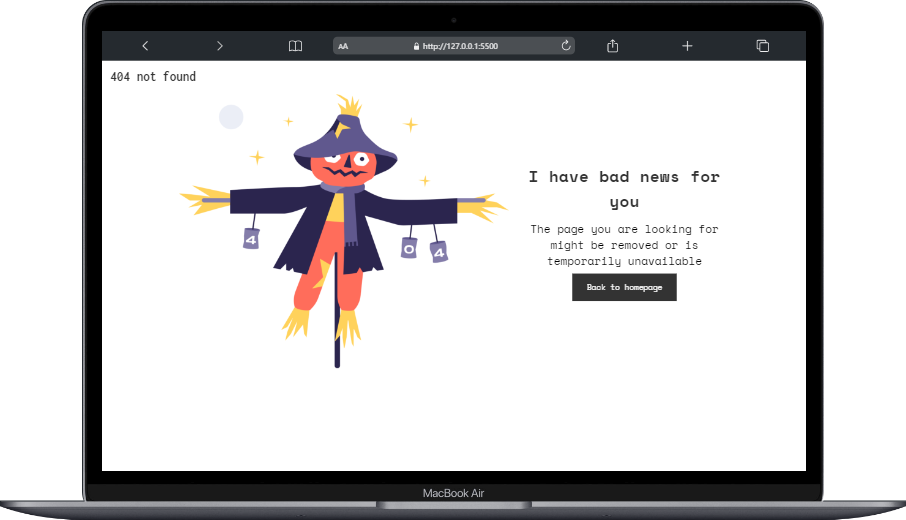
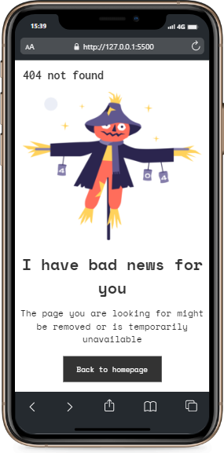

# 🖥️ Projeto 404 Not Found

## ⌨ Descrição
Resolução do site DevChallenges com o objetivo de desenvolver uma tela de erro. Projeto feito usando as tecnologias abaixo.

## ✍️ Processo
- Marcação semântica HTML5
- Propriedades personalizadas de CSS3
- Flexbox  
- Design responsivo
    

## 🖱️ A página  
  
 - Desktop   
   
   
      
 - Mobile  

    

## 👩‍💻 Dev
<table align="center">
  <tr>
    <td align="center">
      

         
          <b> Karine Pereira </b> 
            
            
      

    </td>

  </tr>
</table>